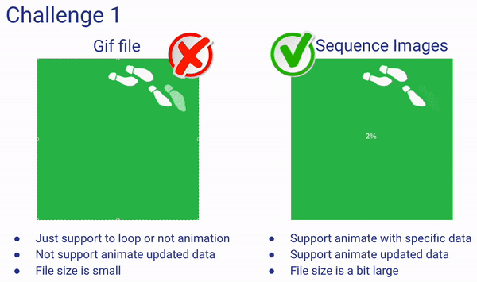
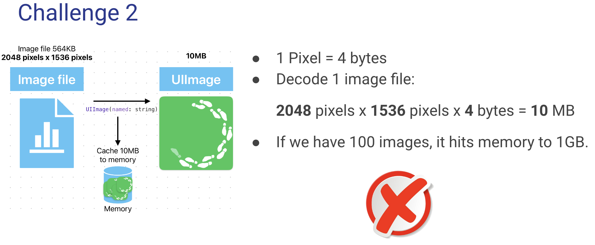
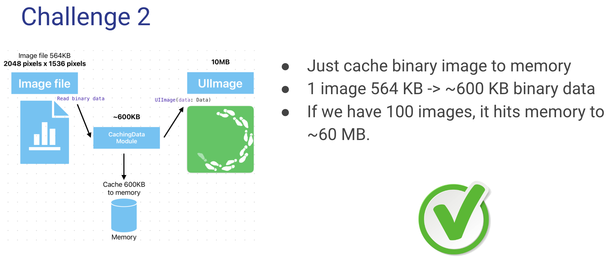

# Demo Sequence Images Loading
This is a demo of sequence images loading. 
This project is the showcase of MVVM architecture, following SOLID principles, SwiftUI, SwiftCombine, GCD and how to integrate UIKit to SwiftUI.

# Why to build Sequence Images Loading module
## The prolem 1
We have 2 solution to load sequence images

## The problem 2

Reference: iOS memory deep dive in WWDC 2018 https://developer.apple.com/videos/play/wwdc2018/416

## The problem 3

# Features 
- Load sequence images as progress bar.
- Aniamate updated values.

# Backlogs
- Move to Swift Package Manager. 
    
# Techniques
- SwiftUI: to develop User Interfaces
- Integrate UIKit to SwiftUI
- SwiftCombine: to bind data
- Grand central Dispatch (GCD): to multithread 
- MVVM architecture: develop application
- Quick, Nimble framework: to write UnitTest
- Follow SOLID principles

## Environment
- XCode 15.0 ++
- iOS 17 ++

## How to run
To run Unit-test, we need to install some libraries from Swift Packages Manager:
- Quick
- Nimble
- View Inspector [Github page](https://github.com/nalexn/ViewInspector)
